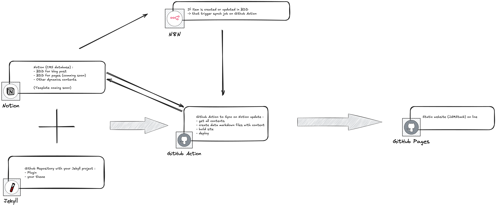

# Jekyll Notion CMS

<p align="center">
  
  
  
  
</p>

<p align="center">
  <strong>Use Notion as a CMS for your Jekyll static site</strong>
</p>

<p align="center">
  <a href="https://badge.fury.io/rb/jekyll-notion-cms"></a>
  <a href="https://github.com/maxime-lenne/jekyll-notion-cms/actions/workflows/ci.yml"></a>
  <a href="https://opensource.org/licenses/MIT"></a>
</p>

---

A configurable Jekyll plugin that fetches content from Notion databases and makes it available as Jekyll data files. Perfect for building landing pages, portfolios, blogs, and resumes with Notion as your content management system.

## Features

- **Configurable Collections**: Define any number of Notion database collections via `_config.yml`
- **Multiple Organizers**: Support for different data organization patterns (simple list, grouped, skills by category, nested)
- **All Property Types**: Support for all Notion property types (text, number, date, select, multi-select, relations, rollups, formulas, files, etc.)
- **Fallback System**: Automatic fallback to Jekyll collections when Notion is unavailable
- **Pagination**: Handles large databases with automatic pagination
- **Caching**: Intelligent file caching to avoid unnecessary regenerations


## Architecture

<p align="center">
  
</p>

The diagram above shows how Jekyll Notion CMS integrates with your workflow:

1. **Content editing** in Notion databases
2. **Change detection** via n8n polling or webhooks
3. **Build trigger** through GitHub Actions workflow_dispatch
4. **Static site generation** with Jekyll + jekyll-notion-cms
5. **Deployment** to GitHub Pages (or any static host)

## Use Cases

### Landing Page

Build dynamic landing pages with content managed entirely in Notion:

| Content Type | Notion Database | Description |
|--------------|-----------------|-------------|
| **Services** | Services DB | List your offerings with icons, descriptions, and pricing |
| **Testimonials** | Testimonials DB | Client reviews with photos, quotes, and ratings |
| **Team** | Team DB | Team member profiles with photos and bios |
| **FAQ** | FAQ DB | Frequently asked questions organized by category |

### Portfolio

Showcase your work with a portfolio powered by Notion:

| Content Type | Notion Database | Description |
|--------------|-----------------|-------------|
| **Projects** | Projects DB | Portfolio pieces with images, descriptions, and links |
| **Skills** | Skills DB | Technical skills organized by category with proficiency levels |
| **Certifications** | Certifications DB | Professional certifications and badges |

### Blog

Run a full-featured blog with Notion as your writing tool:

| Content Type | Notion Database | Description |
|--------------|-----------------|-------------|
| **Posts** | Blog DB | Articles with rich text, tags, and publication dates |
| **Categories** | Categories DB | Blog categories for organization |
| **Authors** | Authors DB | Author profiles for multi-author blogs |

### Resume / CV

Create a dynamic online resume:

| Content Type | Notion Database | Description |
|--------------|-----------------|-------------|
| **Experiences** | Experiences DB | Work history with dates, companies, and descriptions |
| **Education** | Education DB | Academic background and degrees |
| **Skills** | Skills DB | Technical and soft skills with proficiency |
| **Languages** | Languages DB | Language proficiencies |

## Installation

Add this line to your application's Gemfile:

```ruby
gem 'jekyll-notion-cms'
```

And then execute:

```bash
bundle install
```

Or install it yourself as:

```bash
gem install jekyll-notion-cms
```

## Quick Start

### 1. Set up your Notion Integration

1. Go to [Notion Developers](https://www.notion.so/my-integrations)
2. Create a new integration
3. Copy the Internal Integration Token
4. Share your Notion databases with the integration

### 2. Configure Environment Variables

```bash
export NOTION_TOKEN=secret_xxx
export NOTION_EXPERIENCES_DB=your_database_id
export NOTION_BLOG_DB=your_blog_database_id
```

### 3. Add Configuration to `_config.yml`

```yaml
notion:
  enabled: true

  collections:
    experiences:
      database_env: NOTION_EXPERIENCES_DB
      data_file: notion_experiences.yml
      organizer: simple_list
      sort_by: order
      properties:
        - { name: Title, type: title }
        - { name: Company, type: rich_text }
        - { name: Start Date, type: date, key: start_date }
        - { name: Current, type: checkbox }
        - { name: Tags, type: multi_select }

    blog_posts:
      database_env: NOTION_BLOG_DB
      data_file: notion_blog_posts.yml
      organizer: simple_list
      sort_by: published_at
      sort_order: desc
      properties:
        - { name: Title, type: title }
        - { name: Slug, type: rich_text }
        - { name: Language, type: select }
        - { name: Published At, type: date, key: published_at }
        - { name: Status, type: select }
        - { name: Excerpt, type: rich_text }
        - { name: Tags, type: multi_select }
```

### 4. Use Data in Templates

```liquid

  <h3>{{ exp.title }}</h3>
  <p>{{ exp.company }} - {{ exp.start_date }}</p>

```

## Examples & Configuration

For detailed examples and configuration reference, see **[Examples & Configuration](docs/EXAMPLES_AND_CONFIGURATION.md)**.

**Examples included:**
- Projects Database (portfolio, case studies)
- Services Database (freelancers, agencies)
- Testimonials Database (client reviews)
- Skills Database (technical expertise)

**Configuration reference:**
- Collection options
- Organizer types (`simple_list`, `items_by_category`, `grouped_by`, `nested`)
- All 18 property types supported
- Property configuration syntax

## Fallback System

When Notion is unavailable, the plugin automatically falls back to Jekyll collections:

1. **No `NOTION_TOKEN`**: Uses all Jekyll collections
2. **Missing database ID**: Uses fallback for that collection
3. **API Error**: Falls back gracefully with error logging

Create fallback collections in `_collections/`:

```
_collections/
├── _experiences/
│   ├── experience-1.md
│   └── experience-2.md
└── _blog_posts/
    └── my-post.md
```

## Automation & Deployment

### GitHub Actions Workflow

Copy the workflow template to your repository:

```bash
cp docs/templates/github-actions_notion-sync.yml .github/workflows/notion-sync.yml
```

**Full workflow file:** [`docs/templates/github-actions_notion-sync.yml`](docs/templates/github-actions_notion-sync.yml)

```yaml
name: Notion Sync Workflow

on:
  workflow_dispatch:
    inputs:
      notion_event:
        description: 'Type of Notion event'
        required: true
        type: string
      page_id:
        description: 'Notion page ID'
        required: true
        type: string
      database_id:
        description: 'Notion database ID'
        required: true
        type: string
      updated_at:
        description: 'Last update timestamp'
        required: true
        type: string

permissions:
  contents: read
  pages: write
  id-token: write

jobs:
  build:
    runs-on: ubuntu-latest
    steps:
      - name: Checkout
        uses: actions/checkout@v4

      - name: Setup Ruby
        uses: ruby/setup-ruby@v1
        with:
          ruby-version: '3.3'
          bundler-cache: true

      - name: Build with Jekyll
        run: bundle exec jekyll build
        env:
          JEKYLL_ENV: production
          NOTION_TOKEN: ${{ secrets.NOTION_TOKEN }}
          NOTION_SKILLS_DB: ${{ secrets.NOTION_SKILLS_DB }}
          NOTION_EXPERIENCES_DB: ${{ secrets.NOTION_EXPERIENCES_DB }}
          NOTION_BLOG_DB: ${{ secrets.NOTION_BLOG_DB }}
          # Add more database secrets as needed

      - name: Upload artifact
        uses: actions/upload-pages-artifact@v3

  deploy:
    environment:
      name: github-pages
      url: ${{ steps.deployment.outputs.page_url }}
    runs-on: ubuntu-latest
    needs: build
    steps:
      - name: Deploy to GitHub Pages
        id: deployment
        uses: actions/deploy-pages@v4
```

### Automatic Sync with n8n


Use [n8n](https://n8n.io) to automatically trigger builds when Notion content changes.

**Import the workflow template:** [`docs/templates/n8n-workflow_Notion-database-change-trigger-GitHub-Actions.json`](docs/templates/n8n-workflow_Notion-database-change-trigger-GitHub-Actions.json)

**Workflow steps:**

1. **Notion Trigger** - Polls Notion database for changes (configurable interval)
2. **GitHub Action** - Triggers `workflow_dispatch` event on your repository
3. **Notification** (optional) - Sends Telegram/Slack message on deployment

**n8n Configuration:**

| Node | Configuration |
|------|---------------|
| Notion Trigger | Database ID, poll interval (e.g., every hour) |
| GitHub | Repository owner, repo name, workflow ID, branch |
| Telegram/Slack | Chat ID for notifications (optional) |

**Required credentials:**
- Notion API integration token
- GitHub Personal Access Token (with `repo` and `workflow` scopes)

### Manual Trigger

You can also trigger the workflow manually via GitHub CLI:

```bash
gh workflow run notion-sync.yml \
  -f notion_event=manual \
  -f page_id=none \
  -f database_id=all \
  -f updated_at=$(date -u +"%Y-%m-%dT%H:%M:%SZ")
```

Or via the GitHub Actions UI by clicking "Run workflow" on the Actions tab.

## Development

After checking out the repo:

```bash
# Install dependencies
bundle install

# Run tests
bundle exec rspec

# Run linter
bundle exec rubocop

# Run console
bundle exec rake console
```

## Contributing

Bug reports and pull requests are welcome on GitHub at https://github.com/maxime-lenne/jekyll-notion-cms.

1. Fork it
2. Create your feature branch (`git checkout -b feature/my-feature`)
3. Commit your changes (`git commit -am 'Add my feature'`)
4. Push to the branch (`git push origin feature/my-feature`)
5. Create a Pull Request

## License

The gem is available as open source under the terms of the [MIT License](https://opensource.org/licenses/MIT).

## Author

**Maxime Lenne** - [maxime-lenne.fr](https://maxime-lenne.fr)

- GitHub: [@maxime-lenne](https://github.com/maxime-lenne)
- LinkedIn: [maximelenne](https://linkedin.com/in/maximelenne)

##  [N8Ninja](https://n8n-ninja.app): Automate your n8n workflows from your iPhone
[N8Ninja](https://n8n-ninja.app) lets you manage, monitor, and trigger your n8n automations
directly from your iPhone. Intuitive interface, real-time notifications,
and full control over your workflows.

<a href="https://apps.apple.com/fr/app/n8ninja-automatisations-n8n/id6746260475" class="app-store-badge">
    
</a>